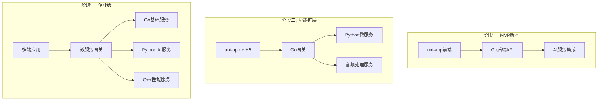

# VoiceGenie

<div align="center">


**智能语音精灵 - 小程序AI实时语音对话应用**

*基于uni-app和Go的跨平台AI语音助手，支持实时语音对话、智能问答和多模态交互*

[功能特性](#功能特性) • [快速开始](#快速开始) • [技术架构](#技术架构) • [开发指南](#开发指南) • [API文档](#api文档)

</div>

---

## 📖 项目简介

VoiceGenie是一个基于现代技术栈的AI语音对话应用，采用渐进式架构设计，支持从MVP到企业级应用的完整演进路径。

### 🎯 核心特性

- **🎤 实时语音对话** - 低延迟音频采集、识别和合成
- **🤖 AI智能问答** - 集成多种大语言模型服务
- **📱 跨平台支持** - uni-app一套代码多端发布
- **⚡ 高性能传输** - WebRTC实时音频传输
- **🔧 模块化设计** - 松耦合架构，易于扩展
- **🛡️ 企业级稳定** - 完善的错误处理和监控

### 🚀 技术亮点

- **前端**: uni-app + TypeScript + WebRTC
- **后端**: Go + Gin + PostgreSQL + Redis
- **AI服务**: 多厂商ASR/LLM/TTS集成
- **部署**: Docker容器化 + 云原生架构

---

## 🏗️ 技术架构

### 渐进式架构演进



### 核心组件

| 组件 | 技术栈 | 职责 |
|------|--------|------|
| **前端应用** | uni-app + TypeScript | 用户界面、音频采集播放 |
| **API网关** | Go + Gin | 请求路由、认证鉴权 |
| **核心服务** | Go + GORM | 业务逻辑、数据处理 |
| **AI服务** | Python + FastAPI | 语音识别、对话生成 |
| **数据存储** | PostgreSQL + Redis | 持久化存储、缓存 |

---

## 🚀 快速开始

### 环境要求

- **Node.js** >= 16.0.0
- **Go** >= 1.19
- **Python** >= 3.8 (阶段二需要)
- **Docker** >= 20.0.0
- **PostgreSQL** >= 13.0
- **Redis** >= 6.0

### 安装步骤

#### 1. 克隆项目

```bash
git clone https://github.com/your-username/VoiceGenie.git
cd VoiceGenie
```

#### 2. 前端开发环境

```bash
cd frontend
npm install
npm run dev:mp-weixin    # 微信小程序
npm run dev:h5           # H5开发
```

#### 3. 后端开发环境

```bash
cd backend
go mod download
cp .env.example .env     # 配置环境变量
go run main.go
```

#### 4. Docker一键启动

```bash
cp .env.example .env     # 配置环境变量
docker-compose up -d
```

### 配置说明

创建 `.env` 文件并配置以下关键参数：

```bash
# 数据库配置
DB_HOST=localhost
DB_PORT=5432
DB_NAME=voicegenie
DB_USER=postgres
DB_PASSWORD=your_password

# Redis配置
REDIS_HOST=localhost
REDIS_PORT=6379
REDIS_PASSWORD=

# AI服务配置
OPENAI_API_KEY=your_openai_key
DEEPGRAM_API_KEY=your_deepgram_key
ELEVENLABS_API_KEY=your_elevenlabs_key

# WebRTC配置
AGORA_APP_ID=your_agora_app_id
AGORA_APP_CERTIFICATE=your_agora_certificate
```

---

## 📱 功能特性

### 🎤 音频功能

- [x] 实时音频录制和播放
- [x] 音频格式转换和压缩
- [x] 静音检测和降噪处理
- [x] WebRTC低延迟传输
- [ ] 音频波形可视化
- [ ] 语音活动检测(VAD)

### 🤖 AI服务

- [x] 多厂商ASR集成（腾讯云、Deepgram）
- [x] LLM对话生成（OpenAI、通义千问）
- [x] TTS语音合成（ElevenLabs、Azure）
- [x] 流式响应处理
- [ ] 多模态AI支持
- [ ] 上下文管理优化

### 💬 对话管理

- [x] 会话历史记录
- [x] 多轮对话支持
- [x] 对话状态管理
- [ ] 会话导出功能
- [ ] 对话模板预设
- [ ] 智能对话总结

### 🔧 系统功能

- [x] 用户认证和授权
- [x] 错误处理和日志
- [x] 性能监控和告警
- [ ] 多语言国际化
- [ ] 主题切换
- [ ] 离线模式支持

---

## 🛠️ 开发指南

### 项目结构

```
VoiceGenie/
├── frontend/              # uni-app前端应用
│   ├── src/
│   │   ├── pages/        # 页面组件
│   │   ├── components/   # 公共组件
│   │   ├── utils/        # 工具函数
│   │   └── api/          # API接口
│   ├── static/           # 静态资源
│   └── package.json
├── backend/              # Go后端服务
│   ├── cmd/             # 应用入口
│   ├── internal/        # 内部包
│   │   ├── api/         # API路由
│   │   ├── service/     # 业务逻辑
│   │   ├── repository/  # 数据访问
│   │   └── model/       # 数据模型
│   ├── pkg/             # 公共包
│   └── configs/         # 配置文件
├── ai-services/         # AI微服务(阶段二)
├── docs/                # 项目文档
├── scripts/             # 部署脚本
├── docker-compose.yml   # Docker配置
└── README.md
```

### 开发规范

#### 代码风格

- **前端**: 使用ESLint + Prettier，遵循Vue风格指南
- **后端**: 使用gofmt + golint，遵循Go编码规范
- **Git**: 使用conventional commits规范

#### 分支管理

- `main`: 生产环境分支
- `develop`: 开发环境分支
- `feature/*`: 功能开发分支
- `hotfix/*`: 紧急修复分支

#### 提交规范

```bash
feat: 添加新功能
fix: 修复bug
docs: 更新文档
style: 代码格式化
refactor: 代码重构
test: 添加测试
chore: 构建过程或辅助工具的变动
```

### 测试策略

#### 单元测试

```bash
# 前端测试
cd frontend && npm run test:unit

# 后端测试
cd backend && go test ./...
```

#### 集成测试

```bash
# API集成测试
cd backend && go test ./test/integration/...

# 端到端测试
npm run test:e2e
```

---

## 📚 API文档

### 认证接口

```http
POST /api/v1/auth/login
POST /api/v1/auth/register
POST /api/v1/auth/refresh
```

### 音频接口

```http
POST /api/v1/audio/upload      # 上传音频文件
GET  /api/v1/audio/download    # 下载音频文件
POST /api/v1/audio/transcribe  # 语音转文字
POST /api/v1/audio/synthesize  # 文字转语音
```

### 对话接口

```http
GET  /api/v1/conversations     # 获取对话列表
POST /api/v1/conversations     # 创建新对话
GET  /api/v1/conversations/:id # 获取对话详情
POST /api/v1/conversations/:id/messages  # 发送消息
```

详细API文档请参考: [API Documentation](./docs/api.md)

---

## 🚀 部署指南

### Docker部署

```bash
# 构建镜像
docker-compose build

# 启动服务
docker-compose up -d

# 查看日志
docker-compose logs -f
```

### 云服务部署

支持主流云服务平台：

- **阿里云**: ECS + RDS + SLB
- **腾讯云**: CVM + TencentDB + CLB
- **AWS**: EC2 + RDS + ALB
- **Azure**: VM + SQL Database + Load Balancer

### 性能监控

- **应用监控**: Prometheus + Grafana
- **日志收集**: ELK Stack
- **错误追踪**: Sentry
- **性能分析**: pprof + Jaeger

---

## 📊 性能指标

### 当前版本 (MVP)

- **响应延迟**: < 1000ms
- **音频质量**: 16kHz采样率
- **并发支持**: 100+用户
- **可用性**: 99%+

### 目标指标 (企业版)

- **响应延迟**: < 500ms
- **音频质量**: 44.1kHz采样率
- **并发支持**: 1000+用户
- **可用性**: 99.9%+

---

## 🤝 贡献指南

我们欢迎所有形式的贡献！请查看 [贡献指南](./CONTRIBUTING.md) 了解详细信息。

### 贡献流程

1. Fork 项目
2. 创建功能分支 (`git checkout -b feature/AmazingFeature`)
3. 提交更改 (`git commit -m 'Add some AmazingFeature'`)
4. 推送到分支 (`git push origin feature/AmazingFeature`)
5. 开启 Pull Request

### 问题反馈

- 🐛 [报告Bug](https://github.com/your-username/VoiceGenie/issues/new?template=bug_report.md)
- 💡 [功能建议](https://github.com/your-username/VoiceGenie/issues/new?template=feature_request.md)
- 📖 [文档改进](https://github.com/your-username/VoiceGenie/issues/new?template=documentation.md)

---

## 📄 许可证

本项目采用 MIT 许可证 - 查看 [LICENSE](LICENSE) 文件了解详情。

---

## 🙏 致谢

- [TEN Framework](https://github.com/TEN-framework/ten-framework) - 技术架构参考
- [uni-app](https://uniapp.dcloud.io/) - 跨平台开发框架
- [Gin](https://gin-gonic.com/) - Go Web框架
- [Agora](https://www.agora.io/) - 实时音视频服务

---

## 📞 联系我们

- **项目主页**: https://github.com/your-username/VoiceGenie
- **文档网站**: https://voicegenie.dev
- **问题讨论**: https://github.com/your-username/VoiceGenie/discussions
- **邮箱**: contact@voicegenie.dev

---

<div align="center">

**⭐ 如果这个项目对您有帮助，请给我们一个Star！⭐**

Made with ❤️ by VoiceGenie Team

</div>